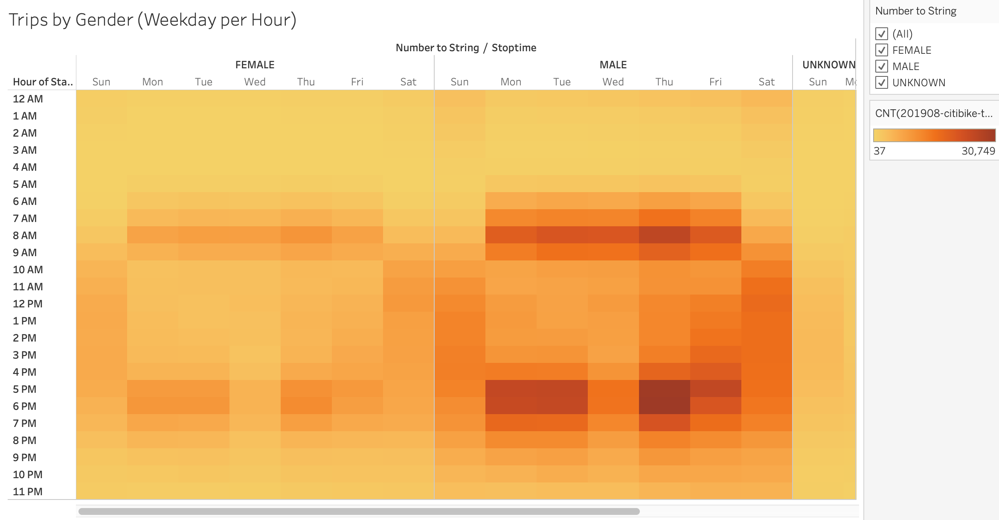
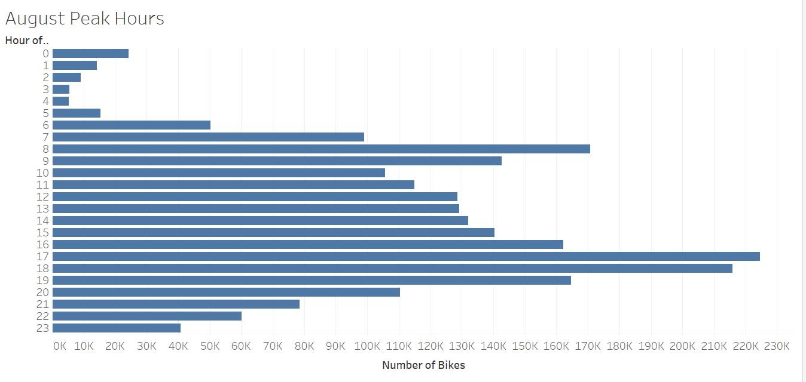

# bikesharing

## Overview

The purpose of this project was to further convince the investors that a bike-sharing program in Des Moines is a solid business proposal. We did so by demonstrating our bike trip analysis in New York involving several visuals such as the length of time that bikes are checked out for, the number of bike trips for all riders, the number of bike trips for each type of user, and more. These visuals also involved the gender or location to have further detailed information. 

## Results

Our line graph shows the length of time that bikes are checked out for all riders. It is clear that these bikes are not used for more than an hour and are mostly used for about 10 minutes.

Our line graph shows the length of time that bikes are checked out for all genders. From this, it is shown that males use more bikes than any other gender but the usage time is similar.

Our heat map shows the number of bike trips for all riders for each hour of each day of the week. It is clear that most bikes are being used on a Thursday at 5 to 7 pm. Our map also shows that most folks do not use bikes from 1 to 4 am. 

Our heat map shows the number of bike trips for all genders for each hour of each day of the week. From our map, males have more bike trips than woman but the times they do so are very similar.

Our heat map shows the number of bike trips for each type of user and gender for each day of the week. It is clear that Male and Female subscribers have a much higher usage of these bikes than customers.

Our bar graph shows the number of bikes used per hour of the day in August. The reason why August was chosen is because it is the month with most bike usage. From our visualization, it is clear that 8 am and 5 to 7 pm are the peak hours for bikes.  

Our geographical map shows the top starting locations for bikes in New York. It is clear that most bikes are being used in the middle to bottom of the city.

## Summary
Based on our results, we have sufficient data to receive support for a bike-sharing program in Des Moines. We gathered information regarding when bikes are used the most, by who they are being used the most, and even where they are being used the most. With this we can place bikes effectively, know when to fix or repair them, and what audiences to target. Even though our visualizations are sufficient, I do believe that 2 more could be added. For example, a visualization that involves which bikes are being used the most would be helpful to make sure enough repairs are done for them to continually work well. Also, a geographical map that shows the top ending locations to understand where drivers are leaving bikes.

[link to dashboard](https://public.tableau.com/app/profile/daniel.roldan/viz/NYCCitibikeAnalysis_16757410915240/NYCCitibikeAnalysis?publish=yes)
